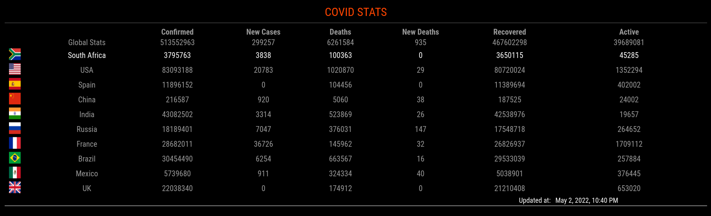

# MMM-CovidStats


A [MagicMirror²](https://magicmirror.builders) module to display Covid Stats from [NovelCOVID API](https://documenter.getpostman.com/view/11144369/Szf6Z9B3?version=latest#a9a60f59-fde4-4e94-b1f1-a3cb92bd1046).

[](LICENSE)

 
 

## Dependencies
- node-fetch 2.6.1
- luxon

## Changes
- Deconstruct Data for future use

## Installation

In your terminal, go to your MagicMirror's Module folder:
````
cd ~/MagicMirror/modules
````

Clone this repository:
````
git clone https://github.com/mumblebaj/MMM-CovidStats.git
````
````
cd MMM-CovidStats
npm install
````

Add the module to the modules array in the `config/config.js` file:
````javascript
        {
                module: 'MMM-CovidStats',
                position: 'middle_center',
                config: {
                                countries: ["USA","ZAF","ESP"],
                                globalStats: true,
                                period: "yesterday",
                                title: "COVID STATS",
                                sortBy: "cases",
                                highlightCountry: "ZAF",
                                updateInterval: 86400000,
                                fadeSpeed: 1000
                        }
        },
````

## Configuration options

The following properties can be configured:


| Option                       | Description
| ---------------------------- | -----------
| `title`                      | The Title text <br>Must be added to the config section
| `countries`                  | An array of iso3 country codes which can be found [here](https://en.wikipedia.org/wiki/ISO_3166-1_alpha-3)
| `globalStats`                | Include Global Stats <br><br> **Possible values:** `true` or `false`
| `highlighCountry`            | The iso3 code of the country to highlight
| `updateInterval`             | The time interval to between fetching new stats <br> **Default value:** `24 hours`
| `fadeInterval`               | The fade interval

## Updating

To update the module to the latest version, use your terminal to go to your MMM-CovidStats module folder and type the following command:

````
cd MMM-CovidStats
git pull
npm install
```` 

